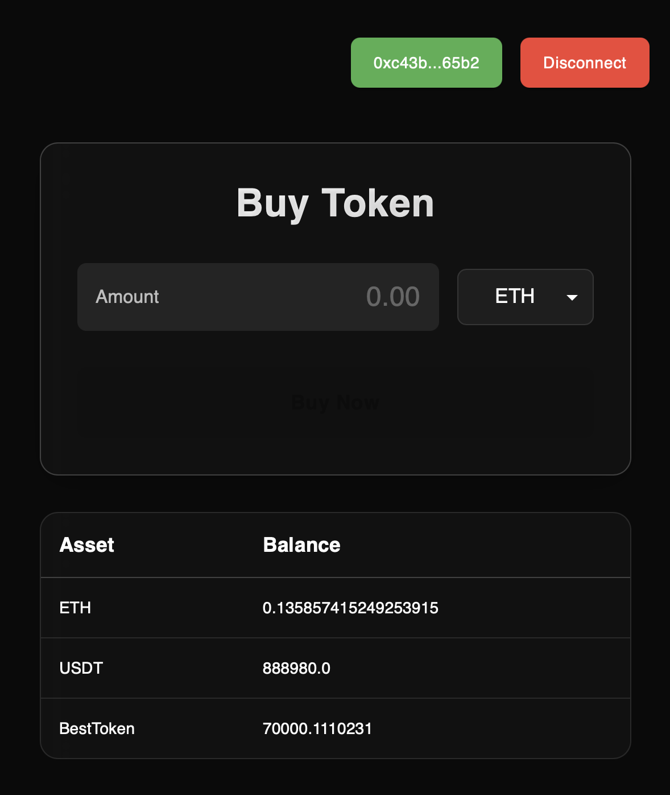
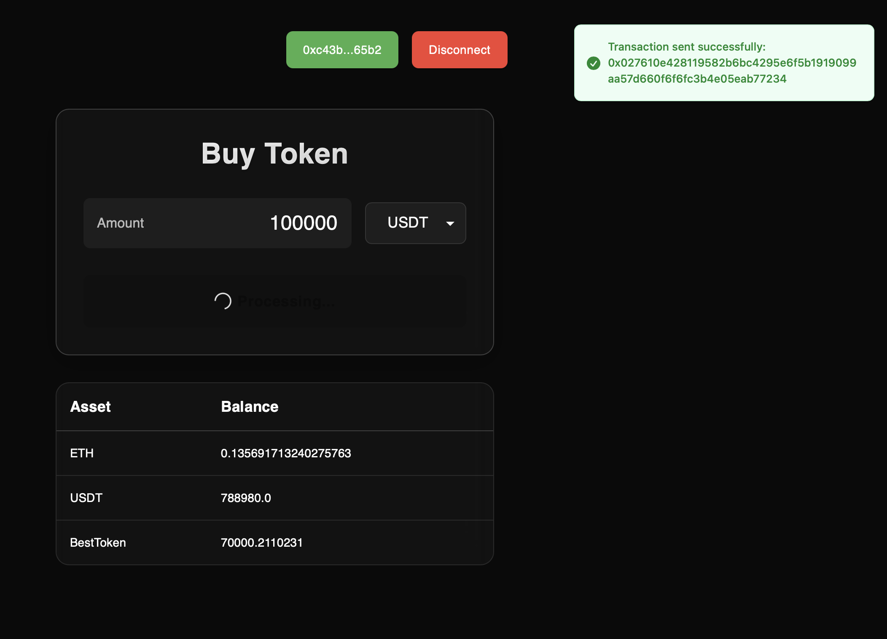

# Crypto Presale DApp

## Project Description

This project is a decentralized application (DApp) designed for a cryptocurrency token presale. Users can connect their Web3 wallets (e.g., MetaMask) to purchase presale tokens using either Ethereum (ETH) or USDT (Tether). The DApp provides a user-friendly interface to display current wallet balances for ETH, USDT, and the presale token.

## Features

- Connects to Web3 wallets (via AppKit Provider).
- Allows purchasing presale tokens with ETH.
- Allows purchasing presale tokens with USDT (requires USDT approval).
- Displays real-time balances for ETH, USDT, and the presale token.
- Provides transaction feedback with success/error messages and Etherscan links.
- Responsive and modern UI with Material-UI components.
- Loading states for transactions to enhance user experience.

## Getting Started

### Installation

1.  **Clone the repository:**

    ```bash
    git clone https://github.com/Artemh59/token-sale
    ```

2.  **Install dependencies:**
    ```bash
    npm install
    # or
    yarn install
    ```

### Environment Variables

Create a `.env` file in the root of your project and add this:
`NEXT_PUBLIC_PROJECT_ID='9e1b6f0b6793fe3f4eba771fd60ab5ef'`
#I left it here only for easy of use this app and i'll delete this project after your check

### Running the Development Server

To run the application in development mode:

```bash
npm run dev
# or
yarn dev
```

Open http://localhost:3000 in your browser to see the application.

## Smart Contracts

My apicaiton interacts with the following smart contracts:

- **Presale Contract**: Handles the logic for purchasing tokens with ETH and USDT.
- **BestToken (ERC-20)**: The main token being sold in the presale.
- **MockUSDT (ERC-20)**: A mock USDT token used for testing the USDT payment functionality.

## Testing

All core functionalities, including wallet connection, ETH and USDT token purchases, and balance displays, have been thoroughly tested and are working as expected.

## Screenshots

### Main application screen displaying user balances



### Transaction Process


